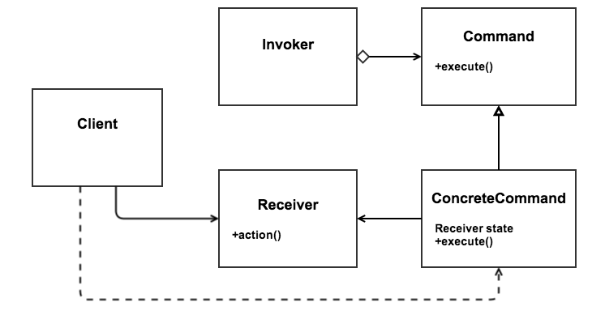

% Command Design Pattern
% Casey Scarborough
% October 3, 2013

\newpage

# What is the Command Design Pattern?

Definition from [Wikipedia](http://en.wikipedia.org/wiki/Command_pattern):

> _The command pattern is a behavioral design pattern in which an object is used to represent and encapsulate all the information needed to call a method at a later time. This information includes the method name, the object that owns the method and values for the method parameters._

In simpler terms, the Command Design pattern gives you a way to execute commands, keep track of them, redo or undo them, along with some other features.

# Parts of the Pattern

The Command Design pattern has five main parts: a _Command_ interface, a _ConcreteCommand_, a _Receiver_, an _Invoker_, and a _Client_. An explanation of these parts is as follows:

* The _Command_ interface declares the methods that will be used for executing an operation.
* The _ConcreteCommand_ will implement the _Command_ interface and also defines a binding between a _Receiver_ and an action.
* The _Client_ handles the creation of the command object and will set its receiver.
* The _Invoker_ asks the command to carry out the request. It actually _invokes_ the command.
* The _Receiver_ knows how to perform the operations associated with each request.

This may seem a little complex, but it will all come together soon enough. The following figure shows the UML diagram for the pattern.



\newpage

# Examples

## Structural Example (Java)

CommandPattern.java

```java
/**
 * This is essentially the Client. It is the main application and
 * handles the creation of the Command object and setting its receiver,
 * and then passing that command object to the invoker. The commands
 * can then be executed via the invoker.
 */
public class CommandPattern {
  public static void main(String[] args) {

    // Create a new receiver.
    Receiver receiver = new Receiver();
    
    // Create a new command and bind it to our receiver.
    Command command = new ConcreteCommand(receiver);

    // Create an invoker to execute commands.
    Invoker invoker = new Invoker();

    // Bind the command to our invoker and execute it.
    invoker.setCommand(command);
    invoker.executeCommand();
  }
}

/**
 * The receiver is the object which the action is being
 * performed on. It knows how to perform the operations
 * associated with carrying out the request.
 */
class Receiver {
  public void action() {
    System.out.println("Receiver.action() method has been called.");
  }
}

/**
 * This is the command interface. It sets the rules
 * that each command will have to follow. In this case,
 * every command must have an execute method.
 */
interface Command {
  public void execute();
}


/**
 * This is an actual command. It implements the Command interface
 * and it defines the binding between the receiver object and its
 * action. It implements the execute method by calling the corresponding
 * action on the receiver.
 */
class ConcreteCommand implements Command {
  private Receiver receiver;

  public ConcreteCommand(Receiver receiver) {
    this.receiver = receiver;
  }

  public void execute() {
    receiver.action();
  }
}

/**
 * The invoker asks the command to carry out the request.
 * It is bound to one specific command at any given time.
 */
class Invoker {
  private Command command;

  public void setCommand(Command command) {
    this.command = command;
  }

  public void executeCommand() {
    this.command.execute();
  }
}
```

\newpage

## Structural Example (C#)

CommandPattern.cs

```cs
using System;

namespace CommandPatternStructural
{   
    // <summary>
    // This is essentially the Client. It is the main application and
    // handles the creation of the Command object and setting its receiver,
    // and then passing that command object to the invoker. The commands
    // can then be executed via the invoker.
    // </summary>
    class CommandPattern
    {
        static void Main(string[] args)
        {   
            // Create a new receiver.
            Receiver receiver = new Receiver();

            // Create a new command and bind it to our receiver.
            Command command = new ConcreteCommand(receiver);

            // Create a new invoker to execute commands.
            Invoker invoker = new Invoker();

            // Set the invoker's command and execute it.
            invoker.SetCommand(command);
            invoker.ExecuteCommand();

            // Wait for user.
            Console.ReadKey();
        }
    }

    // <summary>
    // The receiver is the object which the action is being
    // performed on. It knows how to perform the operations
    // associated with carrying out the request.
    // </summary>
    class Receiver
    {
        public void Action()
        {
            Console.Write("Receiver.Action() has been called!");
        }
    }


    // <summary>
    // The receiver is the object which the action is being
    // performed on. It knows how to perform the operations
    // associated with carrying out the request.
    // </summary>
    public interface Command
    {
        void Execute();
    }

    // <summary>
    // This is an actual command. It implements the Command interface
    // and it defines the binding between the receiver object and its
    // action. It implements the execute method by calling the corresponding
    // action on the receiver.
    // </summary>
    class ConcreteCommand : Command
    {
        private Receiver _receiver;

        public ConcreteCommand(Receiver receiver)
        {
            this._receiver = receiver;
        }

        public void Execute()
        {
            this._receiver.Action();
        }
    }

    // <summary>
    // The invoker asks the command to carry out the request.
    // It is bound to one specific command at any given time.
    // </summary>
    class Invoker
    {
        private Command _command;

        public void SetCommand(Command command)
        {
            this._command = command;
        }

        public void ExecuteCommand()
        {
            this._command.Execute();
        }
    }
}
```


# Resources

* [Wikipedia](http://en.wikipedia.org/wiki/Command_pattern)
* [OODesign](http://www.oodesign.com/command-pattern.html)
* [DoFactory](http://www.dofactory.com/Patterns/PatternCommand.aspx)